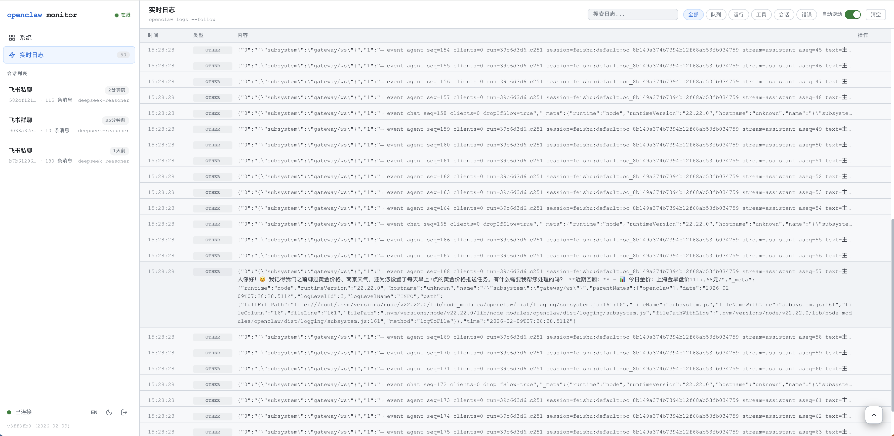
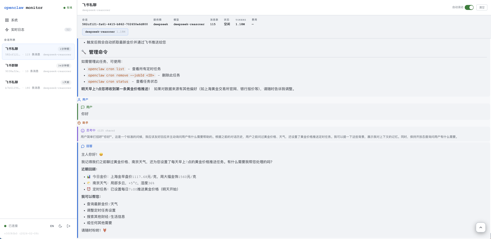
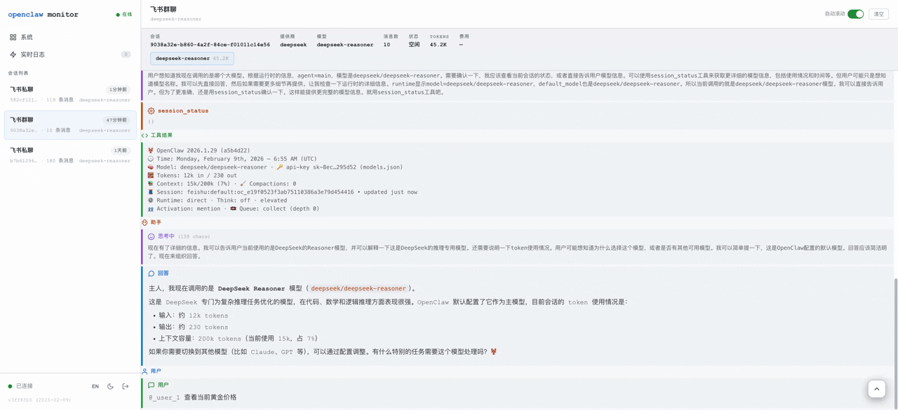
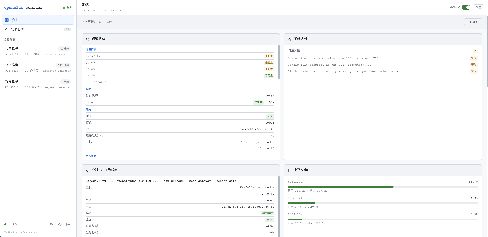
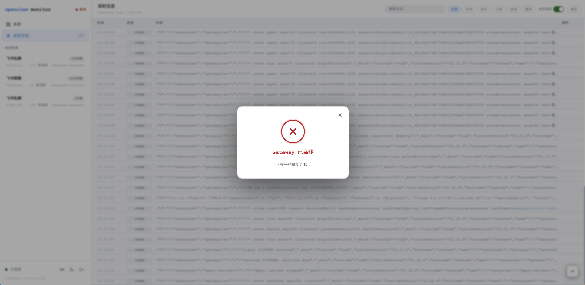

<div align="center">
  <h1>openclaw-monitor</h1>
  <p>面向 <a href="https://github.com/openclaw/openclaw">OpenClaw</a> 的实时监控面板，用于查看会话、日志与 Token 使用情况。</p>
  <p><a href="README.en.md">English README</a></p>
  
</div>

## 功能亮点

- **会话管理** — 查看所有活跃/空闲会话、模型信息、Token 使用量与费用估算
- **实时日志流** — 直接 tail 文件并通过 SSE 推送，无网关 RPC 额外开销
- **会话详情** — 查看单个会话的消息、思考块、工具调用与工具结果
- **Token 与费用** — 按会话/模型统计 Token 使用并估算成本
- **并发与限流** — 最多 2 路并发流，50 行/秒限流保护服务器
- **登录鉴权** — 密码保护访问，安全会话 Cookie
- **Tailscale 支持** — 可绑定 Tailscale 网卡，私网访问
- **深色/浅色主题** — 一键切换主题
- **自动刷新** — 会话列表自动刷新，日志流 SSE 保持连接
- **系统监控** — 实时 CPU、内存、磁盘、网络指标
- **双语界面** — 中英文切换与完整本地化
- **零依赖** — 纯 Python 后端 + 原生 HTML/CSS/JS 前端，无需 npm 或 pip

## 功能截图

- **实时日志流**

  

- **会话详情**

  

- **会话流回放**

  

- **系统监控面板**

  

- **网关告警提示**

  

## 运行要求

- Python 3.10+
- OpenClaw CLI 已安装并可在 `$PATH` 中访问
- systemd（用于用户级服务管理）
- （可选）Tailscale，用于私网绑定

## 快速开始

在新服务器上一行安装：

```bash
curl -fsSL https://raw.githubusercontent.com/devilcoolyue/openclaw-monitor/main/scripts/install.sh | bash
```

该脚本会将仓库克隆到 `~/openclaw-monitor`，提示设置管理员密码，并安装 systemd 用户服务。

自定义安装目录：

```bash
OPENCLAW_MONITOR_DIR=~/my-monitor curl -fsSL https://raw.githubusercontent.com/devilcoolyue/openclaw-monitor/main/scripts/install.sh | bash
```

自定义端口（默认：18765）：

```bash
OPENCLAW_MONITOR_PORT=9999 curl -fsSL https://raw.githubusercontent.com/devilcoolyue/openclaw-monitor/main/scripts/install.sh | bash
```

然后启动服务：

```bash
systemctl --user start openclaw-monitor
```

浏览器打开 `http://<server-ip>:18765`。

## 手动安装

```bash
git clone https://github.com/devilcoolyue/openclaw-monitor.git ~/openclaw-monitor
cd ~/openclaw-monitor

# 设置管理员密码并安装 systemd 服务
./scripts/install.sh

# 启动服务（默认端口：18765）
systemctl --user start openclaw-monitor

# 或者使用自定义端口直接运行
python3 src/server.py --port 9999
```

如果跳过安装或删除 `.auth`，面板将不进行鉴权（公开访问）。

## 使用

### 服务管理

```bash
# 启动
systemctl --user start openclaw-monitor

# 停止
systemctl --user stop openclaw-monitor

# 重启
systemctl --user restart openclaw-monitor

# 状态与健康检查
systemctl --user status openclaw-monitor

# 查看日志
journalctl --user -u openclaw-monitor -f

# 登录时自启动
systemctl --user enable openclaw-monitor

# 取消自启动
systemctl --user disable openclaw-monitor
```

或使用全局 CLI 命令（由 `install.sh` 安装）：

```bash
openclaw-monitor start
openclaw-monitor stop
openclaw-monitor restart
openclaw-monitor status
openclaw-monitor logs
```

或直接使用脚本：

```bash
./scripts/start.sh       # 启动（若已安装服务则委托 systemctl）
./scripts/check.sh       # 健康检查并自动重启
./scripts/update.sh      # 拉取更新并重启服务
./scripts/uninstall.sh   # 清理卸载
```

### Tailscale 绑定

安装时使用 `--tailscale` 参数绑定 Tailscale IP：

```bash
./scripts/install.sh --tailscale
```

或直接运行：

```bash
python3 src/server.py --port 18765 --tailscale
```

此方式会让面板仅在 Tailscale 私网内可访问，需已安装并运行 Tailscale。

## 架构

```
openclaw-monitor/
├── src/                            # Backend — 11 Python modules
│   ├── server.py                   # Entry point: _Server class, BIND_HOST, __main__
│   ├── config.py                   # Configuration, constants, paths, CLI args
│   ├── auth.py                     # Authentication: password verify, session cookies, login page
│   ├── handler.py                  # HTTP handler: do_GET/POST, all _api_* methods (read-only)
│   ├── sse.py                      # SSE utilities: _begin_sse(), _send_sse(), _json_resp()
│   ├── logs.py                     # Log resolution, tailing, parsing, classification
│   ├── sessions.py                 # Session file scanning and info extraction
│   ├── jsonl.py                    # JSONL line parser
│   ├── cli_cache.py                # Background CLI cache worker
│   ├── diagnostics.py              # System file diagnostics
│   └── tailscale.py                # Tailscale IP detection
├── public/
│   ├── index.html                  # HTML structure only (~200 lines)
│   ├── css/                        # 9 CSS files
│   │   ├── base.css                # Variables, reset, scrollbar, icons
│   │   ├── sidebar.css             # Sidebar, navigation, session cards
│   │   ├── boot.css                # Boot detection overlay
│   │   ├── toast.css               # Toast notifications
│   │   ├── main.css                # Main content area, toolbar, filters
│   │   ├── session.css             # Session summary bar
│   │   ├── stream.css              # Log rows, session blocks, markdown
│   │   ├── system.css              # System dashboard cards
│   │   └── mobile.css              # Responsive overrides (loads last)
│   └── js/                         # 16 ES Module files
│       ├── main.js                 # Entry point: init, bindAll, bootCheck
│       ├── state.js                # Global state object S
│       ├── i18n.js                 # Bilingual dictionary, i18n()
│       ├── utils.js                # esc(), fmtTime(), fmtTokens(), renderMd()
│       ├── theme.js                # Dark/light theme toggle
│       ├── lang.js                 # Language toggle and UI text update
│       ├── boot.js                 # Boot detection sequence
│       ├── connection.js           # SSE connection management, health polling
│       ├── sse.js                  # startLive(), startSession()
│       ├── sessions.js             # Session list, switchView()
│       ├── filter.js               # Log filtering and search
│       ├── toast.js                # Toast notification display
│       ├── mobile.js               # Mobile sidebar toggle
│       ├── render-log.js           # Live log row rendering
│       ├── render-session.js       # Session detail block rendering
│       └── render-system.js        # System dashboard rendering
├── scripts/
│   ├── install.sh                  # Interactive install + password setup + systemd
│   ├── start.sh                    # Startup helper (systemd or direct)
│   ├── check.sh                    # Health check with auto-restart
│   ├── update.sh                   # Git pull + service restart
│   └── uninstall.sh                # Clean removal
├── bin/
│   └── openclaw-monitor            # Global CLI wrapper
├── .gitignore
├── LICENSE
└── README.md
```

### API 接口

| Endpoint | Method | Description |
|---|---|---|
| `/api/sessions` | GET | List all sessions with metadata and usage |
| `/api/health` | GET | Check OpenClaw availability and environment |
| `/api/logs/stream` | GET (SSE) | Real-time log stream |
| `/api/session/<id>/stream` | GET (SSE) | Session event stream (history + live tail) |
| `/api/system` | GET | System diagnostics (CPU, memory, disk, network) |
| `/api/version` | GET | Server version |
| `/api/login` | POST | Authenticate with password |
| `/api/logout` | GET | Clear session and log out |

当 `.auth` 存在时，除 `/api/login`、`/api/logout` 与 `/api/version` 外均需要认证。

### 安全说明

- 密码使用 SHA-256 哈希并带 32 字节随机盐
- 会话 Token：`secrets.token_hex(32)` 生成 64 位十六进制
- Cookie 标记：`HttpOnly`、`SameSite=Strict`
- Session TTL：7 天
- 登录页为独立页面（不暴露面板数据）
- 不存在 `.auth` 时禁用鉴权（向后兼容）

### 工作原理

1. 从 `~/.openclaw/agents/main/sessions/*.jsonl` 读取会话数据
2. 通过 `openclaw` CLI 获取会话列表；CLI 不可用时回退到直接扫描
3. 直接 tail `/tmp/openclaw/openclaw-YYYY-MM-DD.log` 进行日志流式传输
4. 并发限制（最多 2 路 SSE）与限流（50 行/秒）保护低内存服务器
5. 内置 HTTP 服务提供模块化单页面板（原生 ES Modules，无构建步骤）
6. 使用 SSE 实现实时更新
7. 后台线程每 120 秒刷新 `openclaw status --json` 的 CLI 缓存
8. 使用 systemd 用户服务管理，确保稳定启动与自动重启

## License

MIT
